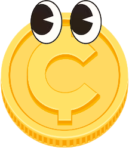
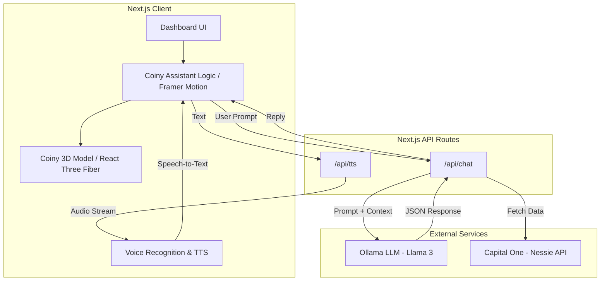

<div align="center">
  <p align="center">
  
</p>
  <p><strong>The Next-Generation AI Financial Assistant for Seniors</strong></p>
  <p>
    <a href="https://github.com/Osas34091/CoinyBank/actions"></a>
    
    
    
    
    
  </p>
</div>

CoinyBank is a modern, accessible web banking prototype designed specifically for seniors. It features **Coiny**, an interactive 3D AI assistant that lives on the screen, ready to help users navigate their finances using natural voice commands or text, powered by local LLMs (Ollama) and the Capital One Nessie API.

---

## 🌟 Features

- **Interactive 3D Mascot (Coiny)** — A fully animated 3D coin built with React Three Fiber. Coiny wanders the screen, jumps, idles, and reacts to user interactions.
- **AI Financial Assistant** — Powered by Ollama, Coiny answers questions strictly based on real user data. He never hallucinates numbers and always provides accurate financial advice.
- **Voice-to-Text Recognition** — Users can speak directly to Coiny using their microphone. The system automatically detects silence (5 seconds) and processes the query.
- **Capital One Nessie API Integration** — Real-time fetching of mock banking data including Accounts, Bills, Loans, and Transactions.
- **Fully Bilingual (i18n)** — Seamless switching between English and Spanish (`next-intl`), including Coiny's voice synthesis (TTS) and UI elements.
- **Accessible & Senior-Friendly UI** — Large text, clear contrasts, and intuitive navigation. No complex menus; Coiny does the heavy lifting.

---

## 🏗️ Architecture



---

## 🚀 Installation & Setup

1. **Clone the repository:**
   ```bash
   git clone https://github.com/Osas34091/CoinyBank.git
   cd CoinyBank
   ```

2. **Install dependencies:**
   ```bash
   npm install
   ```

3. **Environment Variables:**
   Create a `.env.local` file in the root directory and add your Nessie API Key and Ollama URL:
   ```env
   NESSIE_API_KEY=your_nessie_api_key_here
   NEXT_PUBLIC_OLLAMA_URL=http://localhost:11434
   ```

4. **Run Ollama Locally:**
   Make sure you have [Ollama](https://ollama.com/) installed and running with a model (e.g., `llama3`):
   ```bash
   ollama run llama3
   ```

5. **Start the Development Server:**
   ```bash
   npm run dev
   ```
   Open [http://localhost:3000](http://localhost:3000) in your browser.

---

## 🤖 Coiny 3D States & Animations

Coiny's logic is driven by a custom State Machine in `Coin3D.tsx`:

| State | Trigger | Animation Played |
|---------|-------|-------------|
| **Entrance** | On component mount | `Entrance` (Drops in from the side) |
| **Idle** | User inactive | `Looking` or `Flip` (Random every 3-4s) |
| **Thinking** | Waiting for LLM | `Thinking` (Rubbing chin) |
| **Speaking** | Playing TTS Audio | Base Pose + Squash & Stretch scaling |
| **Jumping** | Wandering or Dragging | `Jump` (Arc movement via Framer Motion) |

---

## 📄 License

This project was built for the Capital One Hackathon.
